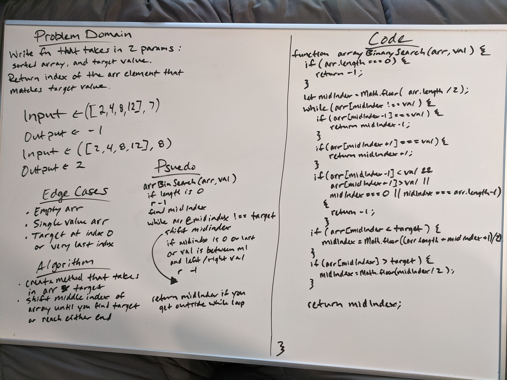

# Array Binary Search

## Challenge
> Write a function called `arrayBinarySearch` which takes in a sorted array and a target value, and returns the index of where that value is found in the array, or -1 if it doesn't exist.

## Approach & Efficiency
For this problem, after researching what binary search is meant to do, I knew I'd have to search half of the array, then half of that half, and so on, until I found the value or determined it didn't exist. I found the middle index of the given array and compared that value to the target value to determine how to proceed.

## Solution

