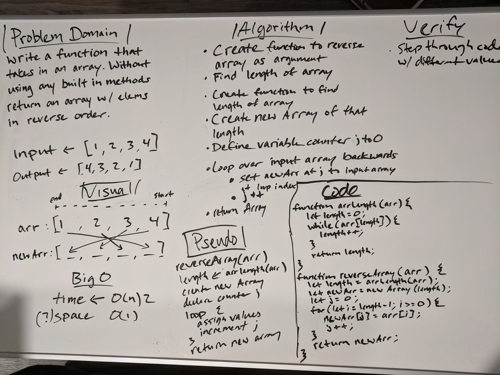

# Reverse an Array

## Challenge
> Write a function called `reverseArray` which takes an array as an argument. Without utilizing any of the built-in methods available to your language, return an array with elements in reversed order.

## Approach & Efficiency
For this problem, knowing I couldn't use any built in methods, I had to think about what those built in methods might be doing, and what other information about the array I would need. In this case it was the length. So I made another function that returned the given arrays length. Then I used that to create a new Array, then looped the input arr backwards and added the values to the newArr, starting from index 0;

## Solution
