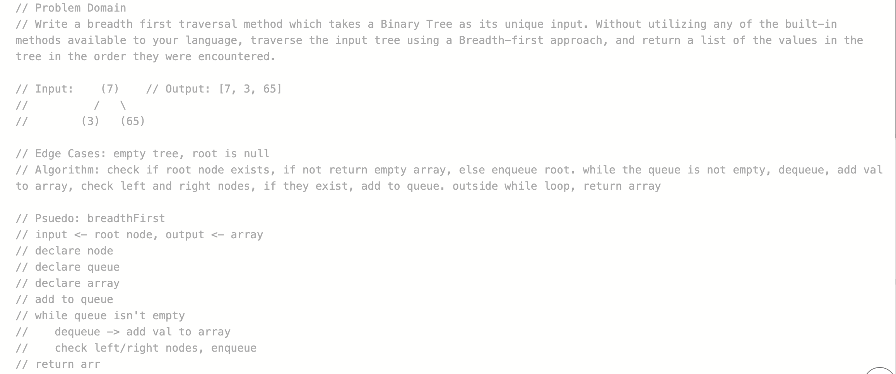
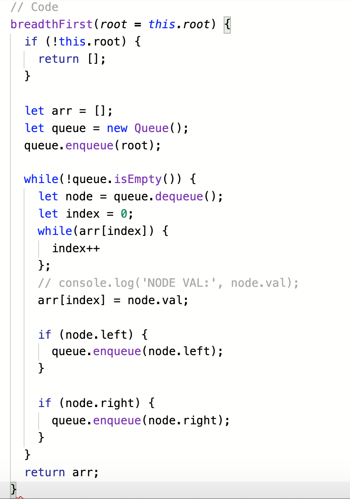

# Challenge - Breadth First Tree  
  
## Challenge Description  
Write a breadth first traversal method which takes a Binary Tree as its unique input. Without utilizing any of the built-in methods available to your language, traverse the input tree using a Breadth-first approach, and return a list of the values in the tree in the order they were encountered.

## Approach & Efficiency
I used a while loop and a queue to keep track of the nodes in a breadth first approach.
BigO: O(n) - this function will have to run until all n nodes have been seen

## Solution

