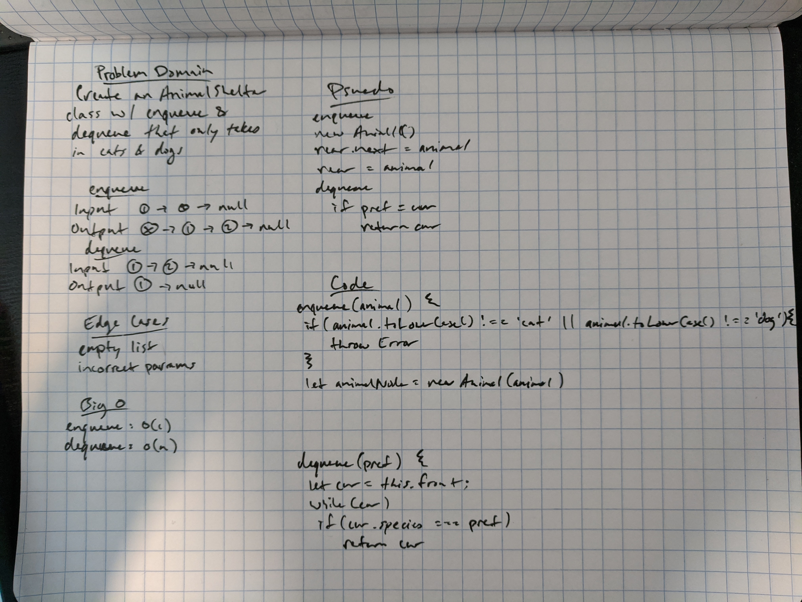

# Challenge Summary
<!-- Short summary or background information -->
Create a class called AnimalShelter which holds only dogs and cats. The shelter operates using a first-in, first-out approach.

## Challenge Description
<!-- Description of the challenge -->
Implement the following methods:  
- `enqueue(animal)`: adds animal to the shelter. animal can be either a dog or a cat object.  
- `dequeue(pref)`: returns either a dog or a cat. If pref is not "dog" or "cat" then return null.

## Efficiency
<!-- What approach did you take? Why? What is the Big O space/time for this approach? -->
- `enqueue(animal)`: O(1)
- `dequeue(pref)`: O(n)

## Solution
<!-- Embedded whiteboard image -->
