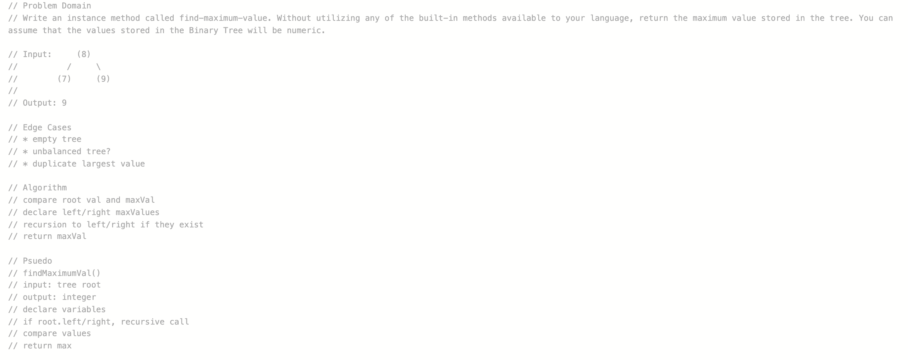
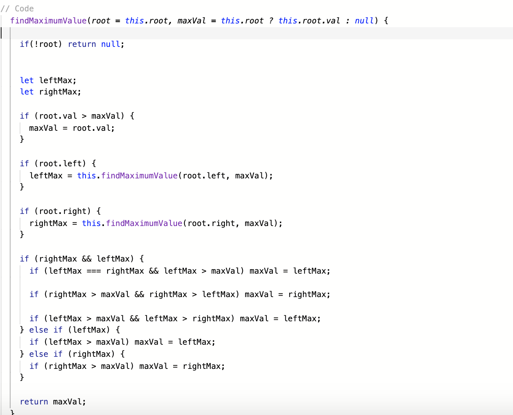

# Challenge - Find Maximum Value in a Tree  

## Challenge Description
Write an instance method called findMaximumValue. Without utilizing any of the built-in methods available to your language, return the maximum value stored in the tree. You can assume that the values stored in the Binary Tree will be numeric.  
  
## Approach & Efficiency
I traveresed the tree recursively, passing through a maxVal variable and root each time, and returning the maxVal variable at the end of each recursive call;

BigO: O(n)

## Solution

