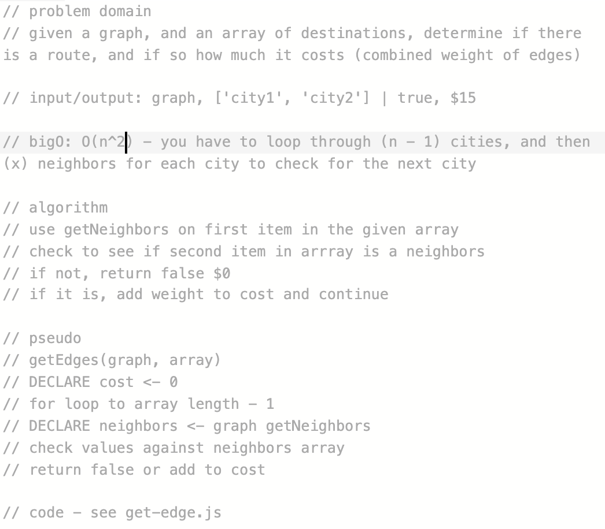

# Find Edges

## Challenge
Create a function that takes in a graph and an array of cities, and determines if there is a route between them, and if so, the cost of the trip

## Approach & Efficiency
BigO: O(n2)
Loop through (n - 1) cities, finding neighbors. If you can't find the next city in the list of neighbors from the current city, return false, otherwise keep going. If you find the city, add it's weight to the cost, and continue.
Return the final cost if you reach the end of the loop

# 