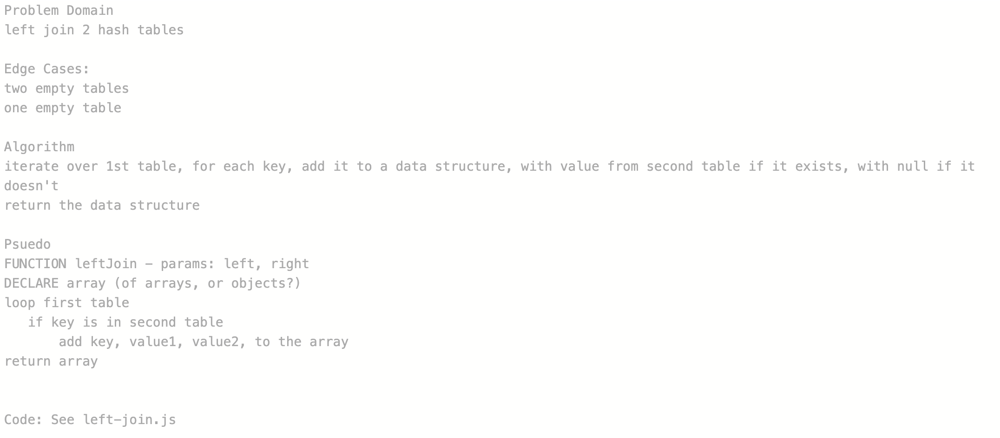

# Hashmap LEFT JOIN

## Challenge
Write a function that executes a left join on two hash tables, combining the key and corresponding values (if they exist) into a single data structure.

## Approach & Efficiency
BigO: 
- O(n) with tables created by good hashing algorithm
- O(n2) with tables created by poor hashing algorithm

## Solution
