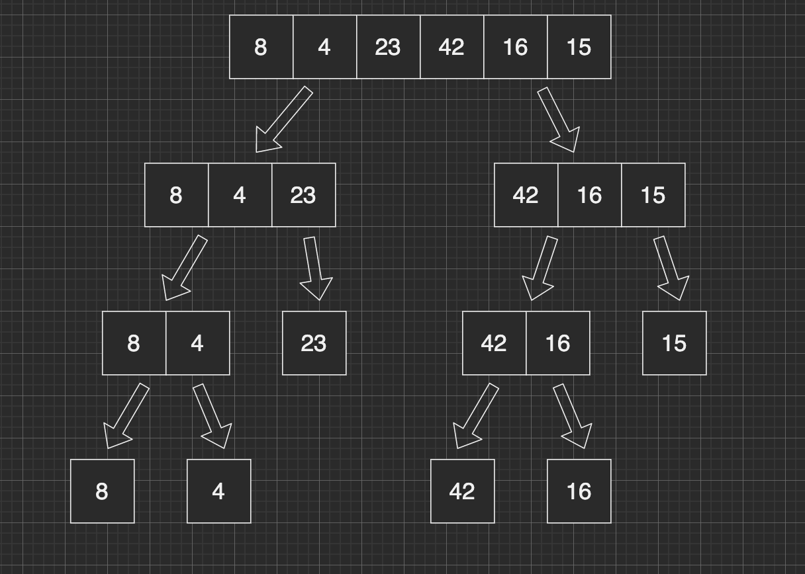
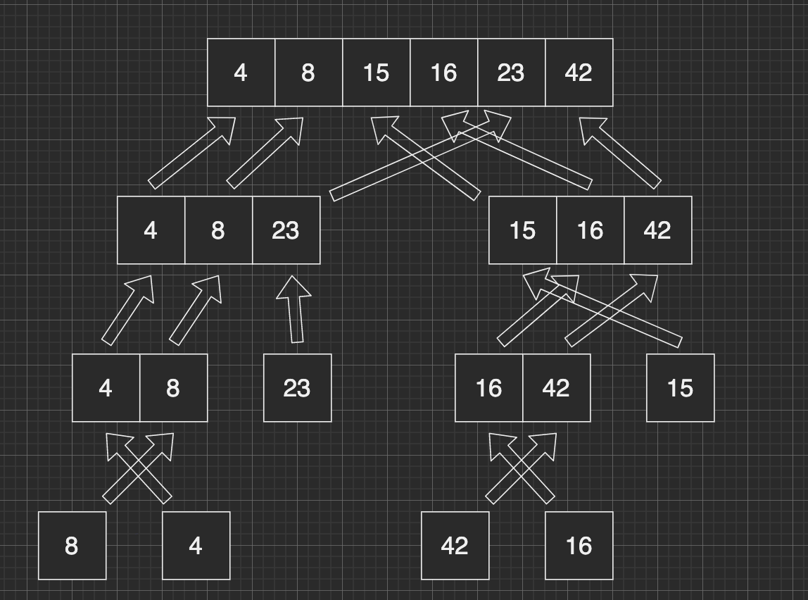

# Merge Sort

## Part 1 - Split arrays

We find a mid point of the given array, and create two new arrays by adding the values of each half of the original array.  
  
Then we make two recursive calls to the same mergeSort function we are in, this time passing in the left side array, and then the right side array. This continues to happen until the array is broken down to arrays of a single element, as shown above. At the end of the merge sort function, we must call a helper function that will contain our algorithm to merge the arrays back together.  

## Part 2 - Merge Arrays
  

  
The second half of this is the helper function that contains the actual mergeSort algorithm.  
  
We look at the two arrays given to us, and compare the values, replacing the "parent" arrays values with the correct sorted values.  
  
Merge Sort modifies the original array. It does not return a new array.