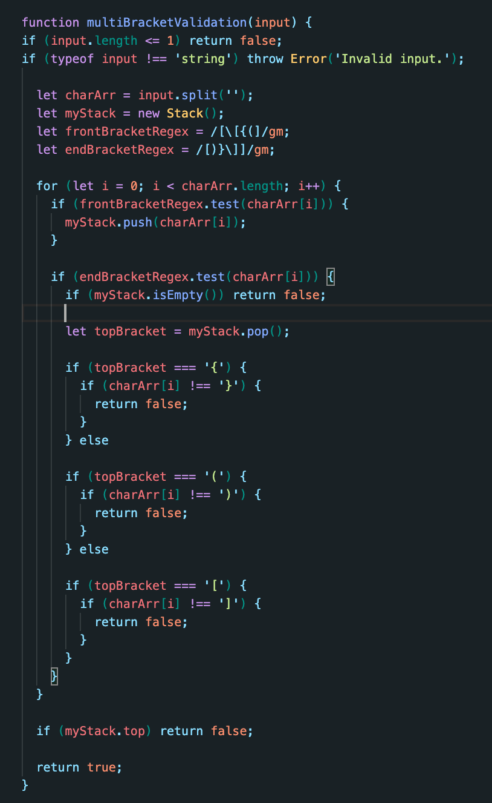

# Challenge Summary
Function that tests bracket balance in a string.

## Challenge Description
Write a function that returns a boolean based on the balance of brackets found in the input string.

## Approach & Efficiency
I used a stack to compare the brackets, because when you encounter an opening bracket, you want that to be the first on you test upon seeing a closing bracket.

### Efficiency
Time - O(n)
Space - O(n)

## Solution
.jpg)  
  
Code didn't fit on one page for whiteboard to here's a picture of the complete code
