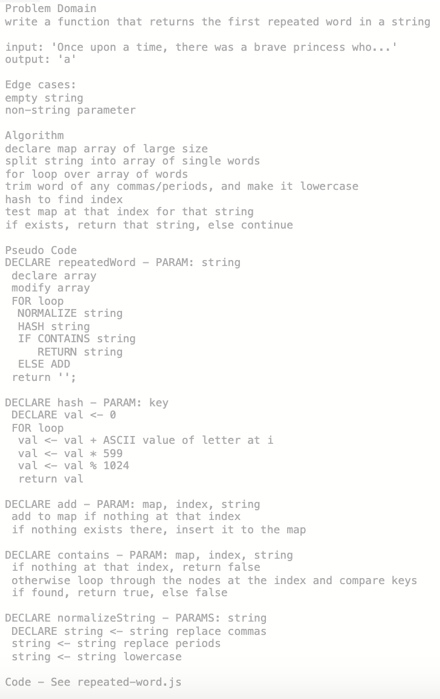

# Repeated Word

## Challenge Description
Write a function that takes in a string and returns the first repeated word in that string.

## Approach & Efficiency
BigO: O(n) n being the number of words in the string - worst case you will have to interate over every word in the string before you find a match, or you might not find any.

## Solution
