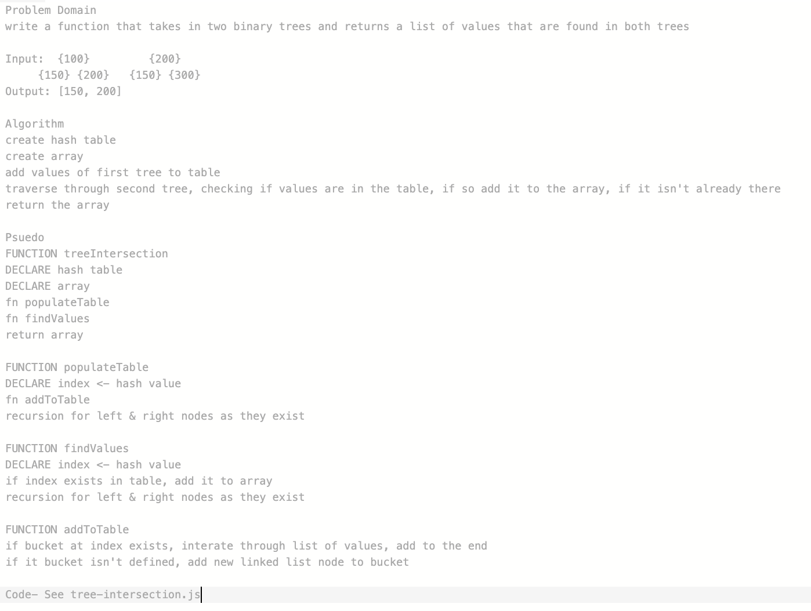

# Tree Intersection

## Challenge Description
Write a function that takes in two binary trees. Return a list of values that are found in both trees.

## Approach & Efficiency
BigO: O(n) n being the number of values in the tree.  
I added each value of the first tree to a hash table, and then interated over the second tree, checking its values against those in the hash table, and adding them to the list if they were found.

## Solution
