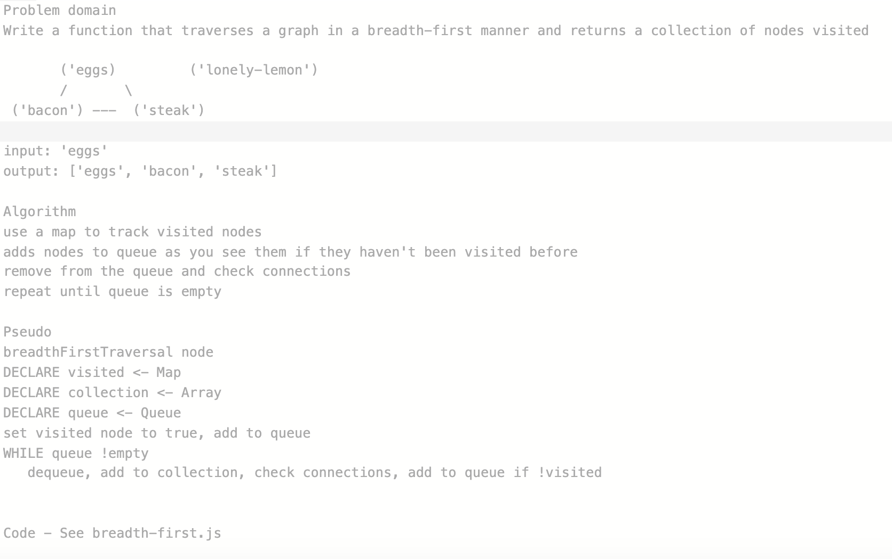

# Breadth-First Traversal of a Graph

## Challenge
Write a function that will take in a node value and traverse the graph in a breadth-first approach, returning a collection of nodes

## Approach & Efficiency
Approach: starting at the given node, add to a queue, mark as visited, in a loop - dequeue, check connections, if they haven't been visited, enqueue, and repeat until the queue is empty.  
  
BigO: O(n) - the function will loop through n connections until the queue has been emptied  

## Solution
