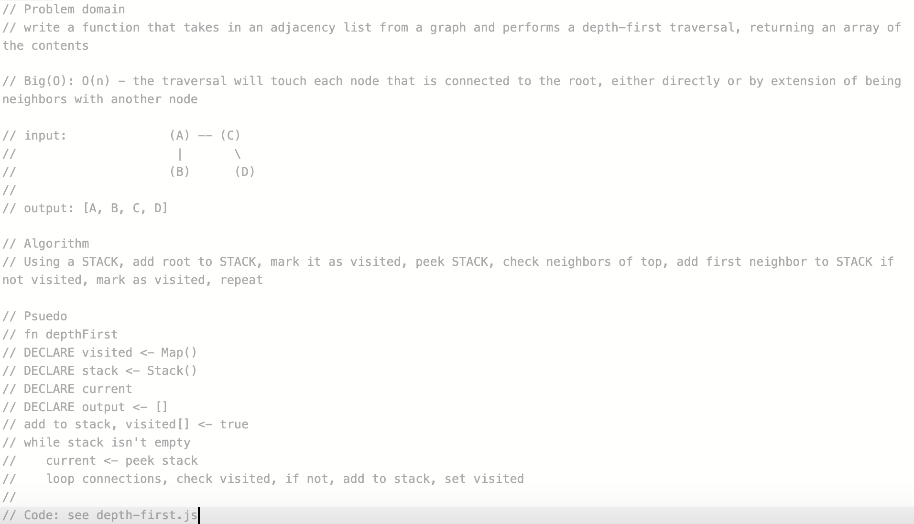

# Depth First Traversal
Write a function that takes in an adjacency list from a graph and traverses that list in a pre-order depth first approach. Return an array of nodes found.

## Big(O): O(n)

## 
